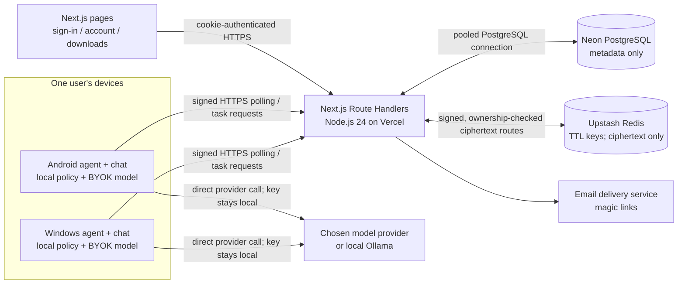

# Pentactopus v1 — Architecture and Reset Audit

**Status:** Phases 1-3 are implemented; Phase 4 has simulation coverage but
still needs real-device acceptance. Phase 5 Android work is in progress and
still needs a successful CI build plus Android 9 and Android 8 device tests.
Security and dependency decisions are listed in [DECISIONS.md](./DECISIONS.md).

## 1. Scope and reset plan

v1 is a personal, single-user multi-device assistant. Each owned device runs
its own local agent, model loop, and policy enforcement. A device may delegate
work to another device of the same account through the server. The server
authenticates, stores metadata, routes work, arbitrates state transitions, and
records metadata-only audit events; it does not call models or decide what an
agent should do.

The reset means replacing the legacy application tree in a new commit while
preserving this repository's Git history. Nothing from the old implementation
is to be copied into v1 unless separately reviewed and explicitly approved.
The executed inventory and approved disposition are in
[Section 10](#10-legacy-repository-disposition).

### Fixed exclusions

No live screen viewing, WebRTC/TURN, direct device-to-device networking,
multi-hub networking, web chat, billing, server-side AI, server-held provider
keys, or unofficial WhatsApp Web libraries. Polling is the sole device
delivery mechanism. Firebase Cloud Messaging, if introduced later, is only a
wake-up signal.

## 2. Confirmed stack proposal

| Area | Selected choice | Basis / boundary |
|---|---|---|
| Web/API | Next.js **16.4.0**, TypeScript, App Router; Route Handlers for APIs and App Router pages for landing, account, and downloads | Official docs identify 16.4.0, published 2026-10-02; Next 16 requires Node 20.9+. Re-check security advisories and pin the approved exact patch with a lockfile when implementation begins. |
| Server runtime | Vercel Node.js **24.x**, Node.js runtime (not Edge) for API Route Handlers | Vercel lists 24.x as its default/current runtime; it also supports 22.x and 20.x. Configure `engines.node` as `24.x`. |
| Database | Neon PostgreSQL using `@neondatabase/serverless` and the Neon **pooled** connection string | Use the driver's `Pool`/WebSocket transport only for PostgreSQL connections in the Node runtime, and reuse a module-level pool within each function instance. Device delivery remains HTTPS polling only. A single conditional `UPDATE … RETURNING` remains the atomic claim primitive. Never use an unpooled URL in Vercel. |
| Contracts | Versioned JSON Schema Draft 2020-12 under `/contracts/v1/`; one schema version for API payloads and task envelopes | Server TypeScript and Windows Python validate the same checked-in schema. Every schema change increments its semantic version; incompatible wire changes increment the major version and use `/api/v2`. |
| Web sign-in | Email magic link via **Resend**; one-use, hashed, short-lived server token; opaque server-side session; no password storage | Use Resend's HTTPS API via built-in `fetch` (no provider SDK dependency planned). Link GET displays a confirmation page; a deliberate POST consumes it to avoid mail scanners consuming links. Cookie is `HttpOnly; Secure; SameSite=Lax` (use `Strict` where compatible), with server-side expiry and revocation. |
| Device authentication | Device-generated Ed25519 keypair; one-use pairing code (10-minute expiry); signed requests with nonce, timestamp, method/path, and body digest | Server keeps only the public key. Reject reused nonce and timestamps outside a narrow window; enforce nonce uniqueness in PostgreSQL. Never send private keys to the server. |
| Windows | Python agent packaged with **PyInstaller one-folder (`onedir`)** output | Easier to inspect, update, and diagnose than one-file self-extraction. Package only reviewed v1 modules; sign the final installer as a separate release concern. Private key is protected by Windows Credential Manager or DPAPI. |
| Android | Native Kotlin app, **minSdk 26 (Android 8.0)** | Device key in Android Keystore. Test on Android 9 and one Android 8 device before release. |
| Local AI | Device makes provider calls with a key held only by that device; local-only provider such as Ollama is supported | The server has no provider SDKs, keys, prompts, or model output. Setup explains model-provider processing and the user's responsibility for provider terms/keys. |

Sources checked for this proposal:

- [Next.js installation and system requirements](https://nextjs.org/docs/app/getting-started/installation)
- [Next.js 16 upgrade guide](https://nextjs.org/docs/app/guides/upgrading/version-16)
- [Vercel supported Node.js versions](https://vercel.com/docs/functions/runtimes/node-js/node-js-versions)
- [Neon serverless driver](https://neon.com/docs/serverless/serverless-driver)
- [Upstash Redis `SET` TTL options](https://upstash.com/docs/redis/sdks/ts/commands/string/set)
- [Upstash Redis REST API](https://upstash.com/docs/redis/features/restapi)

### Temporary storage boundary

Neon stores metadata only. Message-content and artifact ciphertext is stored
in **Upstash Redis** using the serverless HTTPS client, never in Neon or
Vercel Blob. The server validates device signatures and ownership, then
accepts/returns ciphertext bytes; it never decrypts or logs them. This adds
`@upstash/redis`, justified by its serverless HTTP transport and per-key
millisecond TTL (`PX`). Redis keys are random, namespaced IDs; Redis holds
ciphertext only, with no provider keys or plaintext.

Message content uses an expiry no later than 10 minutes from creation; ack
deletes it immediately and Redis TTL makes it unavailable after expiry even
if the target never returns. Create keys with `SET ... NX PX` to avoid
overwriting existing ciphertext or resetting another item's TTL. Artifact
keys expire at the earlier of task or pipeline expiry. All reads are
metadata/ownership/expiry checked against Neon before Redis access. Set-time
TTL is never refreshed by reads. Redis outage
fails closed: no content is accepted or returned, and there is no persistent
fallback. Before implementation, verify the selected Upstash plan's payload
limits, persistence/backup behavior, and deletion semantics. Apply strict
payload size limits in the API and per-user quotas to control cost.
Creation writes ciphertext with a random key and TTL before committing Neon
metadata; if the metadata write fails, the server attempts an immediate Redis
delete and the original TTL remains the orphan-cleanup bound. Acknowledgement
deletes the Redis key before marking metadata acknowledged, so a database
failure can cause a safe re-fetch failure but never extend content lifetime.

## 3. Topology and data flow



```mermaid
sequenceDiagram
  participant O as Origin device (orchestrator)
  participant S as Next.js API
  participant D as Neon (metadata)
  participant B as Temporary inbox (ciphertext)
  participant T as Target device
  participant A as Approving owned device
  O->>S: Signed task create (target, limits, refs; no message plaintext)
  S->>D: Ownership checks + queued task + metadata audit
  T->>S: Signed poll
  S->>D: Atomic queued-to-claimed conditional update
  S-->>T: Claimed task envelope
  opt Encrypted content/artifact is needed
    O->>S: Upload ciphertext addressed to permitted owned device(s)
    S->>B: Store ciphertext with hard TTL
    T->>S: Signed fetch ciphertext
    S->>B: Read only if metadata is live and recipient matches
    S-->>T: Ciphertext only
    T->>T: Decrypt in memory; apply local policy
    T->>S: Signed ack
    S->>B: Delete ciphertext
  end
  opt T4/T5 action
    T->>S: Awaiting approval (task ID + exact-payload hash + expiry)
    T->>S: Upload separate encrypted preview packets for owned approver devices
    S-->>A: Poll pending approval metadata and packet reference
    A->>S: Signed fetch of this device's packet
    S->>B: Read ciphertext after ownership/expiry check
    S-->>A: Ciphertext only
    A->>A: Decrypt in memory; display exact recipient and text
    A->>S: Signed approval/rejection bound to task and action hash
    S->>D: Conditional approval bound to same hash and task
    T->>S: Poll approval; re-check payload hash and local policy
  end
  T->>S: Signed terminal status; metadata-only audit
  S->>D: Persist state and audit metadata
```

The orchestrator is always the device the user originally addressed. It
creates explicit pipeline steps and remains the orchestrator across all
delegations. Every step has one target. A failure stops the pipeline and
returns control to the user; the server never auto-continues later steps.

## 4. Task, policy, and approval contract

The versioned task envelope contains:

```text
schema_version, task_id, root_task_id, parent_task_id,
origin_device_id, orchestrator_device_id, target_device_id,
hop_path[], depth, turn_count, capability, body, input_refs[],
requires_confirmation, status, expires_at
```

`body` is a typed command envelope, not a free-form transcript. It may contain
non-sensitive task instructions/parameters and references to encrypted
content, but never message plaintext, provider keys, or credentials.
`input_refs` are artifact IDs. Each agent validates the envelope against
`/contracts/v1/`, verifies the signed server response, and applies its own
local policy before any action.

Task-state transitions (approval is only required for applicable tiers):

```text
queued -> claimed -> running -> done
             |          |-----> failed
             |          |-----> expired
             |          +-----> rejected
             +-> awaiting_approval -> running
                      |-----> rejected
                      |-----> failed
                      +-----> expired
queued/claimed ----------------> expired
```

The server validates allowed transitions and device ownership. `hop_path` is
initialized with the origin device and each delegated target is appended;
delegation to any device already in the path is rejected. Maximum delegation
depth is 2. A conversation has a finite turn limit (proposed default: 20;
finalize before Phase 2), enforced by a transactional pipeline counter rather
than an unsynchronized per-task check. Claim is one conditional database
update from `queued` to `claimed`, scoped to the target device and account,
with a returned row as the sole claim grant. Polling never grants ownership by
itself. A partial unique index permits only one active
(`claimed`/`awaiting_approval`/`running`) task per target device, including
concurrent claims. The agent does not automatically retry failed/interrupted
non-idempotent work. Offline work stays `queued` until its deadline; sender
status is `queued`, never success-shaped.

| Tier | Example / behavior | Enforcement |
|---|---|---|
| T0 | Device status | No confirmation |
| T1 | Sender names, unread counts, app lists | No confirmation |
| T2 | User-requested read content | No confirmation for this account; content only to its devices |
| T3 | Draft text, not sent | No confirmation; draft stays on device/temporary encrypted transfer |
| T4 | Send/post outbound communication | Explicit approval of exact recipient and exact text; one send per approval |
| T5 | Delete, payment, purchase, credential sharing, settings, install | Explicit approval plus stronger prompt/biometric on executing device |
| T6 | Banking, password managers, 2FA, authentication flows | Forbidden; blocked locally by package and window title |

Approvals bind to `(task_id, SHA-256(exact action payload), expiry)`. Any edit
changes the hash and invalidates the approval. An approval is single-use,
expires after 5 minutes by default, and is recorded without plaintext. The
server only accepts approvals from an active device belonging to the same
user. T5 additionally requires the executing device's local OS/biometric
confirmation; approval from another device cannot substitute for that
stronger local gate. Bulk sends require a full recipient list and a distinct
review of that list. Inbound text is always untrusted data and cannot create
approval or alter policy.

For cross-device approval of a T4 action, the executing device packages the
exact recipient/text payload as ciphertext for the approving device; it also
keeps an execution copy encrypted for itself. The inbox stores only ciphertext
and task metadata stores only the digest/reference. If this cannot be securely
delivered to the approver, approval is unavailable rather than showing a
partial or altered action.

## 5. API surface (v1)

All API routes are `/api/v1/...`; all request/response bodies are validated
against `/contracts/v1/`. API errors use a stable JSON shape containing a
machine-readable `code` and safe `message`; never echo secret inputs. Cookies
authenticate web-account routes. Device routes require Ed25519-signed HTTPS
requests, a fresh timestamp, and a unique nonce. There is no long polling:
device poll calls return immediately and are repeated every few seconds.

| Method and route | Caller | Purpose |
|---|---|---|
| `POST /api/v1/auth/magic-links` | Public, rate-limited | Request email sign-in/account creation; return the same generic response whether or not the account exists. |
| `POST /api/v1/auth/magic-links/consume` | Public, rate-limited | Consume a one-use token and set the secure session cookie. |
| `GET /api/v1/auth/session` | Web session | Current account/session summary. |
| `POST /api/v1/auth/logout` | Web session | Revoke server-side session and clear cookie. |
| `GET /api/v1/devices` | Web session or signed owned device | List this user's devices and public keys; keys are public material needed for device-to-device client encryption. |
| `PATCH /api/v1/devices/{device_id}` | Web session | Rename a device; names are unique within the account. |
| `DELETE /api/v1/devices/{device_id}` | Web session | Revoke a device, its key, pending pairing codes, and active sessions/tasks as defined by policy. |
| `POST /api/v1/pairing-codes` | Web session | Create a one-use code expiring in 10 minutes. |
| `POST /api/v1/devices/register` | New device with pairing code | Register device name, platform, and generated public key; consume code atomically. |
| `POST /api/v1/devices/me/heartbeat` | Signed device | Update metadata-only last-seen/status. |
| `GET /api/v1/devices/me/tasks` | Signed device | Poll immediately for eligible queued tasks plus status changes for this device's active tasks; optional cursor, no long polling. |
| `POST /api/v1/tasks` | Signed device | Create task/pipeline step; server checks ownership, target, hop path, depth, limits, and expiry. |
| `POST /api/v1/tasks/{task_id}/claim` | Signed target device | Atomically claim one queued task. |
| `GET /api/v1/tasks/{task_id}` | Signed involved device or session owner | Read task metadata/state only, after ownership check. |
| `POST /api/v1/tasks/{task_id}/transitions` | Signed task device | Request an allowed state transition with metadata-only result details. |
| `POST /api/v1/tasks/{task_id}/approval-requests` | Signed executing device | Store action hash/tier/expiry and mark task awaiting approval. |
| `GET /api/v1/devices/me/approvals` | Signed owned device | Poll pending approvals and this device's encrypted preview-packet references. |
| `POST /api/v1/tasks/{task_id}/approvals` | Signed owned device | Approve/reject exact hash; conditional update prevents replay, edits, expiry, and duplicate use. |
| `POST /api/v1/inbox` | Signed owned device | Accept at most 1 MiB ciphertext, validate ownership, store in Redis with a TTL capped at 10 minutes, and create Neon metadata. |
| `GET /api/v1/inbox/{inbox_id}` | Signed intended recipient device | Return ciphertext only if same account, intended recipient, and unexpired metadata all match. |
| `POST /api/v1/inbox/{inbox_id}/ack` | Signed intended recipient device | Acknowledge delivery, immediately delete the Redis key, and mark metadata deleted. |
| `POST /api/v1/artifacts` | Signed owned device | Accept at most 1 MiB ciphertext, store in Redis with TTL capped by task/pipeline expiry, and store metadata in Neon. |
| `GET /api/v1/artifacts/{artifact_id}` | Signed same-account device | Return ciphertext only if same account, intended target, and unexpired metadata match. |
| `GET /api/v1/settings` | Web session or signed owned device | Read non-content per-user preferences. |
| `PUT /api/v1/settings` | Web session or signed owned device | Sync allowed preferences, including full-text/summary mode. |
| `GET /api/v1/audit-events` | Web session | Paginated metadata-only audit events for this account. |
| `GET /api/v1/health` | Public | Minimal liveness response; no database identifiers/secrets. |

### Contract-level request and response shapes

Device requests use `X-Device-Id`, `X-Device-Timestamp`, `X-Device-Nonce`,
and `X-Device-Signature` headers. The Ed25519 signature covers the HTTP method,
canonical path/query, timestamp, nonce, and SHA-256 digest of the exact raw
request body. The canonical UTF-8 message is
`UPPERCASE_METHOD + "\n" + URL.pathname + URL.search + "\n" + unix_seconds +
"\n" + nonce + "\n" + lowercase_hex_sha256(raw_body)`. The path/query is taken
from the server-parsed URL without reordering query parameters. Nonces are
base64url text of 16–128 characters; signatures are unpadded base64url Ed25519
signatures (64 decoded bytes); public keys are raw 32-byte Ed25519 keys encoded
as unpadded base64url. Timestamp skew is at most 300 seconds and the unique
nonce is retained for 10 minutes. Empty requests sign the SHA-256 digest of
zero bytes.

All API JSON uses `{ "schema_version": "...", "data": ... }` on success and
`{ "schema_version": "...", "error": { "code": "...", "message": "..." } }`
on failure. Secrets and raw request bodies are never echoed. Important
endpoint bodies/results are. API envelopes and task envelopes currently use
schema version `1.0.3`; ciphertext is capped at 1 MiB decoded, JSON requests
at 2 MiB, and generic task metadata at 16 KiB:

| Endpoint group | Request fields | Response fields |
|---|---|---|
| Magic-link request/consume | `{email}` then `{token}` | Generic accepted response; consume sets session cookie and returns account summary. |
| Device/pairing | Pairing creation `{}`; registration `{pairing_code,name,platform,public_key}`; rename `{name}` | Pairing code is shown once with `expires_at`; registration returns `{device_id,name}`; device list includes IDs, names, platform, status, and public keys. |
| Device polling | Optional opaque `cursor` query | `{tasks,active_task_updates,next_cursor,server_time}`; each task is a versioned task envelope. Empty queue is a successful empty list. |
| Task creation | `{target_device_id,parent_task_id?,capability,body,input_refs,requires_confirmation,expires_at}` | Server-created task envelope with origin/orchestrator from signed identity, initialized hop path, root/parent IDs, depth, count, status, and expiry. The caller cannot choose another origin/orchestrator identity. |
| Claim/transition | Claim has no body; transition `{status,outcome_code?,approval_id?,action_hash?,local_confirmation?}` | Claim returns exactly one envelope or `204`; an approval-bound transition consumes one exact approval before entering `running`. Tier 5 additionally requires local confirmation on the executing device. |
| Approval request/list/decision | Request `{action_hash,tier,preview_inbox_ids}`; decision `{approval_id,action_hash,decision}` | Request returns approval ID and expiry; list returns pending approval metadata plus only the requesting device's packet reference; decision returns resulting status. |
| Inbox/artifact | JSON includes `{task_id,target_device_id,ciphertext_b64,expires_at}` or `{task_id,intended_device_id,ciphertext_b64,media_type,expires_at}`; decoded ciphertext is at most 1 MiB and server computes byte length and SHA-256 | Create returns opaque ID, digest, and expiry; reads return ciphertext (base64) only after authorization and expiry checks. |
| Settings/audit | Settings `{message_presentation}`; audit optional cursor/limit | Settings value and update time; audit page of allowlisted metadata events plus next cursor. |

The server derives `user_id` and device identity from authentication rather
than accepting them as caller-controlled fields. Timestamps/expiry limits,
task-state transition rules, approval-to-inbox ownership, and all referenced
artifact ownership are validated before writes. Exact recipient/text content
exists only in ciphertext blobs; it is absent from task bodies and API logs.

App Router pages: `/` landing/setup and policy disclosures, `/account` sign-in
and device/settings/audit views, `/download/windows`, `/download/android`.
Downloads serve only published v1 release artifacts; no web chat UI is added.
Email links use a page/POST confirmation flow so automated link scanners do
not consume credentials.

Every route that accepts an object ID scopes its query by authenticated
`user_id` and, where applicable, device ID. Return indistinguishable not-found
responses for another user's IDs. Device registration is the only unsigned
device endpoint and requires a single-use pairing code plus a valid public
key; it has strict rate limits.

## 6. PostgreSQL schema

UUID primary keys are generated server-side. All timestamps are `timestamptz`
in UTC. Foreign keys and uniqueness constraints enforce account ownership
where possible; every API read/write still applies explicit authorization.
The migration set is versioned and applied forward-only.

| Table | Principal columns and constraints |
|---|---|
| `users` | `id uuid PK`, `email text UNIQUE NOT NULL`, `created_at`, `disabled_at`; normalized email. No password or provider API key. |
| `magic_link_tokens` | `id uuid PK`, `email text NOT NULL`, `token_hash bytea UNIQUE NOT NULL`, `expires_at`, `consumed_at`, `created_at`; only hash stored; consume once conditionally. |
| `web_sessions` | `id uuid PK`, `user_id FK`, `token_hash bytea UNIQUE NOT NULL`, `created_at`, `expires_at`, `revoked_at`, `last_seen_at`; cookie holds only random opaque bearer token. |
| `devices` | `id uuid PK`, `user_id FK`, `name text NOT NULL`, `platform enum`, `public_key bytea NOT NULL`, `created_at`, `revoked_at`, `last_seen_at`; unique case-insensitive `(user_id, name)`, `UNIQUE(user_id, id)` for composite ownership FKs. |
| `pairing_codes` | `id uuid PK`, `user_id FK`, `code_hash bytea UNIQUE NOT NULL`, `expires_at`, `consumed_at`, `created_at`; one use and maximum 10 minutes. |
| `device_nonces` | `device_id FK`, `nonce text`, `request_timestamp timestamptz`, `expires_at`; `PRIMARY KEY(device_id, nonce)`; retain at least the accepted replay window plus clock skew. |
| `user_settings` | `user_id PK/FK`, `message_presentation enum('full','summary') DEFAULT 'full'`, `updated_at`; no message content. |
| `pipelines` | `id uuid PK`, `user_id FK`, `root_task_id`, `orchestrator_device_id`, `turn_count integer`, `max_turns integer DEFAULT 20 CHECK =20`, `status`, `created_at`, `expires_at`; turn count is locked/incremented transactionally; orchestrator is immutable for the conversation. |
| `tasks` | `id uuid PK`, `user_id FK`, `pipeline_id FK`, `root_task_id`, `parent_task_id`, `origin_device_id`, `orchestrator_device_id`, `target_device_id`, `hop_path uuid[]`, `depth smallint CHECK 0..2`, `turn_count integer CHECK 0..20`, `capability text`, `body jsonb`, `input_refs uuid[]`, `requires_confirmation boolean`, `status enum`, `outcome_code nullable`, `expires_at`, `claimed_at`, `created_at`, `updated_at`; composite ownership FKs bind all device IDs to `user_id`; indexes on `(target_device_id,status,expires_at)` and `(user_id,created_at)`. Add a partial unique index on `target_device_id WHERE status IN ('claimed','awaiting_approval','running')`. Capability/outcome values are machine identifiers. `body` is limited to 16 KiB, rejects sensitive-content field names, and references encrypted artifacts for content. |
| `pipeline_steps` | `pipeline_id FK`, `step_index integer`, `task_id UNIQUE FK`, `target_device_id`, `status`, `output_artifact_id nullable`; `PRIMARY KEY(pipeline_id, step_index)`; exactly one target per step. |
| `artifacts` | `id uuid PK`, `user_id FK`, `created_by_device_id`, `intended_device_id nullable`, `redis_key text UNIQUE`, `ciphertext_sha256 bytea`, `byte_length bigint CHECK 1..1,048,576`, `media_type text`, `created_at`, `expires_at`, `deleted_at`; Redis TTL expires no later than its task/pipeline; no content or plaintext filename. |
| `inbox_items` | `id uuid PK`, `user_id FK`, `source_device_id`, `target_device_id`, `task_id FK`, `redis_key text UNIQUE`, `ciphertext_sha256 bytea`, `byte_length bigint CHECK 1..1,048,576`, `created_at`, `expires_at`, `acked_at`, `deleted_at`; Redis TTL expires within 10 minutes. |
| `approvals` | `id uuid PK`, `user_id FK`, `task_id FK`, `action_hash bytea`, `tier smallint CHECK IN (4,5)`, `status enum('pending','approved','rejected','expired','used')`, `requested_by_device_id`, `approved_by_device_id nullable`, `created_at`, `expires_at`, `approved_at`, `used_at`; unique active request per `(task_id, action_hash)`; no recipient/text payload. |
| `approval_packets` | `user_id FK`, `approval_id FK`, `approver_device_id FK`, `inbox_item_id FK UNIQUE`, `created_at`; one Redis-backed ciphertext preview per active owned device so any signed-in device can review the exact action without exposing plaintext to the server. |
| `audit_events` | `id bigint GENERATED ... PK`, `user_id FK`, `actor_device_id nullable`, `task_id nullable`, `event_type text`, `metadata jsonb`, `created_at`; append-only application role; metadata allowlist, no raw request bodies, message text, provider prompts, keys, or ciphertext. |
| `rate_limit_buckets` | `bucket_hash bytea PK`, `window_start`, `hit_count`, `expires_at`; the keyed HMAC digest is stored instead of an IP address or email identifier. |

The following PostgreSQL DDL matches the initial migration at
[`migrations/0001_v1_core.sql`](./migrations/0001_v1_core.sql), the executable
source of truth. Migrations are forward-only and applied with
`npm run db:migrate`.

```sql
CREATE TYPE device_platform AS ENUM ('windows', 'android');
CREATE TYPE message_presentation AS ENUM ('full', 'summary');
CREATE TYPE task_status AS ENUM (
  'queued', 'claimed', 'awaiting_approval', 'running',
  'done', 'failed', 'rejected', 'expired'
);
CREATE TYPE pipeline_status AS ENUM (
  'queued', 'running', 'awaiting_approval', 'done', 'failed', 'rejected', 'expired'
);
CREATE TYPE approval_status AS ENUM (
  'pending', 'approved', 'rejected', 'expired', 'used'
);

CREATE TABLE users (
  id uuid PRIMARY KEY,
  email text NOT NULL UNIQUE,
  created_at timestamptz NOT NULL DEFAULT now(),
  disabled_at timestamptz,
  CHECK (email = lower(email))
);

CREATE TABLE magic_link_tokens (
  id uuid PRIMARY KEY,
  email text NOT NULL,
  token_hash bytea NOT NULL UNIQUE,
  created_at timestamptz NOT NULL DEFAULT now(),
  expires_at timestamptz NOT NULL,
  consumed_at timestamptz,
  CHECK (octet_length(token_hash) = 32),
  CHECK (email = lower(email)),
  CHECK (expires_at > created_at)
);
CREATE INDEX magic_link_tokens_expiry_idx ON magic_link_tokens (expires_at);

CREATE TABLE web_sessions (
  id uuid PRIMARY KEY,
  user_id uuid NOT NULL REFERENCES users(id),
  token_hash bytea NOT NULL UNIQUE,
  created_at timestamptz NOT NULL DEFAULT now(),
  expires_at timestamptz NOT NULL,
  revoked_at timestamptz,
  last_seen_at timestamptz,
  CHECK (octet_length(token_hash) = 32),
  CHECK (expires_at > created_at)
);
CREATE INDEX web_sessions_user_idx ON web_sessions (user_id, expires_at);

CREATE TABLE devices (
  id uuid PRIMARY KEY,
  user_id uuid NOT NULL REFERENCES users(id),
  name text NOT NULL,
  platform device_platform NOT NULL,
  public_key bytea NOT NULL,
  created_at timestamptz NOT NULL DEFAULT now(),
  revoked_at timestamptz,
  last_seen_at timestamptz,
  UNIQUE (user_id, id),
  CHECK (name ~ '^[A-Za-z0-9][A-Za-z0-9 ._-]{0,79}$'),
  CHECK (octet_length(public_key) = 32)
);
CREATE UNIQUE INDEX devices_user_name_ci_idx
  ON devices (user_id, lower(name));

CREATE TABLE pairing_codes (
  id uuid PRIMARY KEY,
  user_id uuid NOT NULL REFERENCES users(id),
  code_hash bytea NOT NULL UNIQUE,
  created_at timestamptz NOT NULL DEFAULT now(),
  expires_at timestamptz NOT NULL,
  consumed_at timestamptz,
  CHECK (octet_length(code_hash) = 32),
  CHECK (expires_at > created_at),
  CHECK (expires_at <= created_at + interval '10 minutes')
);
CREATE INDEX pairing_codes_user_expiry_idx ON pairing_codes (user_id, expires_at);

CREATE TABLE device_nonces (
  device_id uuid NOT NULL REFERENCES devices(id),
  nonce text NOT NULL,
  request_timestamp timestamptz NOT NULL,
  expires_at timestamptz NOT NULL,
  PRIMARY KEY (device_id, nonce),
  CHECK (length(nonce) BETWEEN 16 AND 128),
  CHECK (expires_at > request_timestamp)
);
CREATE INDEX device_nonces_expiry_idx ON device_nonces (expires_at);

CREATE TABLE user_settings (
  user_id uuid PRIMARY KEY REFERENCES users(id),
  message_presentation message_presentation NOT NULL DEFAULT 'full',
  updated_at timestamptz NOT NULL DEFAULT now()
);

CREATE TABLE pipelines (
  id uuid PRIMARY KEY,
  user_id uuid NOT NULL REFERENCES users(id),
  root_task_id uuid NOT NULL,
  orchestrator_device_id uuid NOT NULL,
  turn_count integer NOT NULL DEFAULT 0 CHECK (turn_count >= 0),
  max_turns integer NOT NULL DEFAULT 20,
  status pipeline_status NOT NULL DEFAULT 'queued',
  created_at timestamptz NOT NULL DEFAULT now(),
  expires_at timestamptz NOT NULL,
  UNIQUE (user_id, id),
  FOREIGN KEY (user_id, orchestrator_device_id)
    REFERENCES devices (user_id, id),
  CHECK (max_turns = 20 AND turn_count <= max_turns),
  CHECK (expires_at > created_at)
);

CREATE TABLE tasks (
  id uuid PRIMARY KEY,
  user_id uuid NOT NULL REFERENCES users(id),
  pipeline_id uuid NOT NULL,
  root_task_id uuid NOT NULL,
  parent_task_id uuid,
  origin_device_id uuid NOT NULL,
  orchestrator_device_id uuid NOT NULL,
  target_device_id uuid NOT NULL,
  hop_path uuid[] NOT NULL,
  depth smallint NOT NULL CHECK (depth BETWEEN 0 AND 2),
  turn_count integer NOT NULL CHECK (turn_count BETWEEN 0 AND 20),
  capability text NOT NULL CHECK (capability ~ '^[a-z][a-z0-9_.-]{0,99}$'),
  body jsonb NOT NULL,
  input_refs uuid[] NOT NULL DEFAULT '{}',
  requires_confirmation boolean NOT NULL DEFAULT false,
  status task_status NOT NULL DEFAULT 'queued',
  outcome_code text CHECK (outcome_code IS NULL OR outcome_code ~ '^[a-zA-Z0-9_.-]{1,80}$'),
  expires_at timestamptz NOT NULL,
  claimed_at timestamptz,
  created_at timestamptz NOT NULL DEFAULT now(),
  updated_at timestamptz NOT NULL DEFAULT now(),
  UNIQUE (user_id, id),
  FOREIGN KEY (user_id, pipeline_id) REFERENCES pipelines (user_id, id),
  FOREIGN KEY (user_id, root_task_id)
    REFERENCES tasks (user_id, id) DEFERRABLE INITIALLY DEFERRED,
  FOREIGN KEY (user_id, parent_task_id)
    REFERENCES tasks (user_id, id) DEFERRABLE INITIALLY DEFERRED,
  FOREIGN KEY (user_id, origin_device_id) REFERENCES devices (user_id, id),
  FOREIGN KEY (user_id, orchestrator_device_id) REFERENCES devices (user_id, id),
  FOREIGN KEY (user_id, target_device_id) REFERENCES devices (user_id, id),
  CHECK (jsonb_typeof(body) = 'object'),
  CHECK (cardinality(hop_path) BETWEEN 1 AND 3),
  CHECK (array_position(hop_path, NULL) IS NULL),
  CHECK (origin_device_id = ANY(hop_path)),
  CHECK (target_device_id = hop_path[array_upper(hop_path, 1)]),
  CHECK (depth = cardinality(hop_path) - 1),
  CHECK (expires_at > created_at)
);
ALTER TABLE pipelines
  ADD CONSTRAINT pipelines_root_task_owner_fk
  FOREIGN KEY (user_id, root_task_id) REFERENCES tasks (user_id, id)
  DEFERRABLE INITIALLY DEFERRED;
CREATE INDEX tasks_poll_idx ON tasks (target_device_id, status, expires_at);
CREATE INDEX tasks_user_created_idx ON tasks (user_id, created_at);
CREATE UNIQUE INDEX one_active_task_per_device_idx
  ON tasks (target_device_id)
  WHERE status IN ('claimed', 'awaiting_approval', 'running');

CREATE TABLE artifacts (
  id uuid PRIMARY KEY,
  user_id uuid NOT NULL REFERENCES users(id),
  task_id uuid NOT NULL,
  created_by_device_id uuid NOT NULL,
  intended_device_id uuid,
  redis_key text NOT NULL UNIQUE,
  ciphertext_sha256 bytea NOT NULL,
  byte_length bigint NOT NULL CHECK (byte_length BETWEEN 1 AND 1048576),
  media_type text NOT NULL,
  created_at timestamptz NOT NULL DEFAULT now(),
  expires_at timestamptz NOT NULL,
  deleted_at timestamptz,
  UNIQUE (user_id, id),
  FOREIGN KEY (user_id, task_id) REFERENCES tasks (user_id, id),
  FOREIGN KEY (user_id, created_by_device_id) REFERENCES devices (user_id, id),
  FOREIGN KEY (user_id, intended_device_id) REFERENCES devices (user_id, id),
  CHECK (octet_length(ciphertext_sha256) = 32),
  CHECK (expires_at > created_at)
);
CREATE INDEX artifacts_task_expiry_idx ON artifacts (task_id, expires_at);

CREATE TABLE pipeline_steps (
  user_id uuid NOT NULL REFERENCES users(id),
  pipeline_id uuid NOT NULL,
  step_index integer NOT NULL CHECK (step_index >= 0),
  task_id uuid NOT NULL UNIQUE,
  target_device_id uuid NOT NULL,
  status task_status NOT NULL,
  output_artifact_id uuid,
  PRIMARY KEY (pipeline_id, step_index),
  FOREIGN KEY (user_id, pipeline_id) REFERENCES pipelines (user_id, id),
  FOREIGN KEY (user_id, task_id) REFERENCES tasks (user_id, id),
  FOREIGN KEY (user_id, target_device_id) REFERENCES devices (user_id, id),
  FOREIGN KEY (user_id, output_artifact_id) REFERENCES artifacts (user_id, id)
);

CREATE TABLE inbox_items (
  id uuid PRIMARY KEY,
  user_id uuid NOT NULL REFERENCES users(id),
  source_device_id uuid NOT NULL,
  target_device_id uuid NOT NULL,
  task_id uuid NOT NULL,
  redis_key text NOT NULL UNIQUE,
  ciphertext_sha256 bytea NOT NULL,
  byte_length bigint NOT NULL CHECK (byte_length BETWEEN 1 AND 1048576),
  created_at timestamptz NOT NULL DEFAULT now(),
  expires_at timestamptz NOT NULL,
  acked_at timestamptz,
  deleted_at timestamptz,
  UNIQUE (user_id, id),
  UNIQUE (user_id, id, target_device_id),
  FOREIGN KEY (user_id, source_device_id) REFERENCES devices (user_id, id),
  FOREIGN KEY (user_id, target_device_id) REFERENCES devices (user_id, id),
  FOREIGN KEY (user_id, task_id) REFERENCES tasks (user_id, id),
  CHECK (octet_length(ciphertext_sha256) = 32),
  CHECK (expires_at > created_at),
  CHECK (expires_at <= created_at + interval '10 minutes')
);
CREATE INDEX inbox_recipient_expiry_idx
  ON inbox_items (target_device_id, expires_at);

CREATE TABLE approvals (
  id uuid PRIMARY KEY,
  user_id uuid NOT NULL REFERENCES users(id),
  task_id uuid NOT NULL,
  action_hash bytea NOT NULL,
  tier smallint NOT NULL CHECK (tier IN (4, 5)),
  status approval_status NOT NULL DEFAULT 'pending',
  requested_by_device_id uuid NOT NULL,
  approved_by_device_id uuid,
  created_at timestamptz NOT NULL DEFAULT now(),
  expires_at timestamptz NOT NULL,
  approved_at timestamptz,
  used_at timestamptz,
  UNIQUE (user_id, id),
  FOREIGN KEY (user_id, task_id) REFERENCES tasks (user_id, id),
  FOREIGN KEY (user_id, requested_by_device_id) REFERENCES devices (user_id, id),
  FOREIGN KEY (user_id, approved_by_device_id) REFERENCES devices (user_id, id),
  CHECK (octet_length(action_hash) = 32),
  CHECK (expires_at > created_at),
  CHECK (expires_at <= created_at + interval '5 minutes')
);
CREATE INDEX approvals_pending_expiry_idx ON approvals (status, expires_at);
CREATE UNIQUE INDEX approvals_one_live_action_idx ON approvals (task_id, action_hash)
  WHERE status IN ('pending', 'approved');

CREATE TABLE approval_packets (
  user_id uuid NOT NULL REFERENCES users(id),
  approval_id uuid NOT NULL,
  approver_device_id uuid NOT NULL,
  inbox_item_id uuid NOT NULL UNIQUE,
  created_at timestamptz NOT NULL DEFAULT now(),
  PRIMARY KEY (approval_id, approver_device_id),
  FOREIGN KEY (user_id, approval_id) REFERENCES approvals (user_id, id),
  FOREIGN KEY (user_id, approver_device_id) REFERENCES devices (user_id, id),
  FOREIGN KEY (user_id, inbox_item_id, approver_device_id)
    REFERENCES inbox_items (user_id, id, target_device_id)
);
CREATE INDEX approval_packets_device_idx
  ON approval_packets (approver_device_id, approval_id);

CREATE TABLE audit_events (
  id bigint GENERATED ALWAYS AS IDENTITY PRIMARY KEY,
  user_id uuid NOT NULL REFERENCES users(id),
  actor_device_id uuid,
  task_id uuid,
  event_type text NOT NULL,
  metadata jsonb NOT NULL DEFAULT '{}',
  created_at timestamptz NOT NULL DEFAULT now(),
  FOREIGN KEY (user_id, actor_device_id) REFERENCES devices (user_id, id),
  FOREIGN KEY (user_id, task_id) REFERENCES tasks (user_id, id),
  CHECK (jsonb_typeof(metadata) = 'object')
);
CREATE INDEX audit_events_user_created_idx
  ON audit_events (user_id, created_at DESC);

CREATE TABLE rate_limit_buckets (
  bucket_hash bytea PRIMARY KEY,
  window_start timestamptz NOT NULL,
  hit_count integer NOT NULL CHECK (hit_count > 0),
  expires_at timestamptz NOT NULL
);
CREATE INDEX rate_limit_buckets_expiry_idx ON rate_limit_buckets (expires_at);
```

Status enums/check constraints are introduced in migrations with explicit
allowed-transition logic in transactional SQL. A claim is a single SQL
statement with conditions for `status='queued'`, target device, user, and
non-expiry; it changes the task to `claimed` and returns it. The partial
unique index arbitrates simultaneous claims of different tasks for the same
device; a uniqueness conflict means no task was claimed. Uniqueness on device
nonce plus the task's conditional update provides race/replay protection
across function instances.

The schema deliberately contains no ciphertext bytes. Message-content keys
are deleted immediately on acknowledgement and have Redis TTL no later than
10 minutes; artifact keys expire at their task/pipeline deadline. Request
handlers reject expired metadata even if Redis retains a key longer due to
backend behavior. Verify TTL and persistence behavior on the selected Redis
plan; do not claim physical-media erasure from logical key expiry.

## 7. Privacy, message presentation, and WhatsApp

- Message content is read from the source app, encrypted on the source device
  for the intended owned device(s), stored only as temporary ciphertext, and
  decrypted in memory at the recipient. Acknowledgement deletes the Redis key;
  10-minute TTL expires unacknowledged content. No content enters Neon,
  structured logs, error reports, analytics, or audit metadata.
- Audit examples are metadata-only: “PC read 2 messages for phone at 14:02.”
  Do not log message sender, recipient, body, phone number, or exact text.
- Default message display is FULL TEXT. Summary mode is opt-in per user.
  Names, phone numbers, addresses, dates, times, amounts, quantities, links,
  attachments, and direct questions remain verbatim in all modes. A “full”
  request always returns verbatim text. The provider/local model is not
  permitted to rewrite or omit those protected elements in presentation.
- The setup screen states that message text may be processed by the chosen
  model provider, that third-party senders are not parties to the user's
  provider agreement, and that the user is responsible for provider account
  and key. It also offers local-only inference (for example Ollama).
- Windows automation is capability-based and not tied to a messaging app;
  WhatsApp was an example use case only. The first desktop action is an unsent
  T3 draft in Notepad. Android reads notification content through
  `NotificationListenerService`; sending uses the user's chat UI via
  Accessibility only after T4 approval. No unofficial WhatsApp Web client.

## 8. Threat model

### Assets

Account/session tokens, device private keys, pairing codes, ownership
relationships, task state, approval integrity, exact outbound payloads,
message-content ciphertext, local provider keys, local policy, and audit
integrity.

### Trust boundaries and adversaries

Treat the public internet, email scanners, other account holders, stolen or
revoked devices, compromised device processes, malicious/injected message
text, model output, object-store URLs, and concurrent/replayed HTTP requests
as untrusted. Neon and the server are trusted for metadata confidentiality,
ownership enforcement, task routing, and state integrity, but are explicitly
not trusted with plaintext message content or model credentials.

### Principal threats and controls

| Threat | Required controls |
|---|---|
| Cross-user task/artifact/approval access | `user_id`-scoped queries, composite ownership FKs, target-device checks, indistinguishable 404, isolation tests. |
| Device request replay or impersonation | Ed25519 signatures over method/path/timestamp/nonce/body digest; strict time window; unique nonce row; revoked-key rejection; TLS. |
| Pairing-code theft/brute force | High-entropy short code, store only hash, one use, 10-minute expiry, rate limit, account binding, user-visible device name/public-key confirmation. |
| Multiple workers claim one task | Conditional SQL update; one returned row grants execution; concurrency race test. |
| Approval payload edit, replay, or race | Hash exact canonical payload; bind task/hash/expiry; single-use conditional transition; display recipient and text; T5 executing-device prompt. |
| Prompt injection via messages/artifacts | Content treated only as untrusted data; cannot alter policy or approve; local policy/T6 block is outside model control; tool calls require policy authorization. |
| Message plaintext leaks via server/logs | End-to-end encryption to owned device(s); opaque inbox; no raw body logs; redacted error paths; metadata allowlist; retention tests. |
| Expired or misrouted ciphertext | Recipient-bound API authorization, ciphertext digest/size, Redis 10-minute message-content TTL, task-bounded artifact TTL, authenticated ack/delete, ownership and expiry tests. |
| Compromised device/local key | OS-protected key storage, device revocation, minimal task capabilities, local policy, no auto-retry of non-idempotent actions. A compromised authorized endpoint remains a residual risk. |
| Session theft/CSRF | Random opaque cookie, HttpOnly/Secure/SameSite, server-side expiry/revocation, CSRF token/origin validation for mutations, rate limits. |
| Magic-link enumeration or scanner consumption | Generic response, hashed token, single use, short expiry, POST confirmation, request rate limits. |
| Secret or content leakage in logs/backups | Allowlisted metadata schema, secret-free `.env.example`, restricted database roles/backups, no message/body logging. |
| T6 forbidden app activity | Device-side package/window-title deny rules checked immediately before action; block rather than downgrade/continue; tests. |

Residual risks: a compromised OS or malicious accessibility/UI automation target
can expose data locally; recipient devices can capture displayed plaintext;
end-to-end guarantees depend on correct client encryption and key protection;
email account compromise can authorize web sign-in; Redis provider persistence
and physical-media deletion behavior must be independently verified. The
product must communicate these limits.

## 9. Phase gates and verification

**Phase 1 (approved):** stack and reset inventory approved. The user approved
removing legacy files while preserving Git history.

**Phase 2 planning (approved):** Resend, Upstash Redis for temporary
ciphertext, a 20-turn conversation cap, a 1 MiB ciphertext object limit,
Ajv + Python `jsonschema`, and the existing MIT license are selected.

**Phase 2 implementation:** Completed and approved. The API/task schemas were
revised to 1.0.1 for parent-task delegation/exact-approval fields, 1.0.2 for
strict metadata-only task bodies, and 1.0.3 to remove shadow
device/artifact/step identifiers. Route handlers, auth, device pairing and
signatures, task/approval state, temporary inbox, metadata audit, and targeted
tests are implemented.

**Phase 3:** Windows agent, local policy, polling, local BYOK, capability-based
desktop automation, T3/T4 flow, local audit, and mocked UI/model tests are
implemented. WhatsApp was an illustrative use case, not a required Windows
app.

**Phase 4:** Simulation coverage exists for the requested cross-device flows.
Real two-device end-to-end acceptance remains outstanding.

**Phase 5:** Android Kotlin client work is in progress: notification listener,
chat/approval UI, local policy, Keystore-backed secrets, pairing, and signed
foreground polling are present. Task execution and cross-device approval
synchronization are not integrated. A successful Android CI build and tests on
Android 9 and one Android 8 device remain required.

At each gate, do not start the next phase without explicit approval. Any new
dependency must be listed with purpose and security/maintenance rationale
before it is added.

## 10. Legacy repository disposition

The original branch had 270 tracked files and was not a clean v1 baseline.
The user approved removing legacy application code/assets from the working
tree while preserving commit history. No legacy implementation was approved
for reuse.

| Existing tracked path(s) | Tracked files | Approved disposition (executed) |
|---|---:|---|
| `.github/workflows/` | 2 | Remove old Tauri/Android release workflows; add v1 CI only in its implementation phase. |
| `.organization/` | 3 | Remove obsolete project/launch registry material. |
| `adb/`, `agent/`, `android/`, `hub/`, `models/`, `organization/`, `pc_control/`, `penta/`, `penta-app/`, `vision/` | 70 | Remove old agents, Tauri app, control/vision, and Android prototype code. Android v1 will be implemented fresh in Phase 5. |
| `api/` | 9 | Remove the Python/Vercel API; replace with Next.js Route Handlers in Phase 2. |
| `sms-webhook-bridge/` | 69 | Remove unrelated SMS bridge and checked-in Gradle build/cache outputs. |
| `tests/` | 24 | Remove legacy tests; create focused v1 tests with the respective phases. |
| `docs/`, `marketing/`, `reports/` | 57 | Remove historical product/launch/audit/promo materials that document excluded features. `DESIGN.md` becomes the v1 architecture source. |
| `tools/`, `scripts/`, `data/`, `public/`, `temp-release2/` | 19 | Remove old utilities, local data, public binaries, and release staging assets. Add only reviewed v1 download assets later. |
| Root legacy runtime/build files: `main.py`, `ui.py`, `local_ui_template.py`, `run_sidecar.py`, `run_ui.bat`, `build_sidecar.ps1`, `requirements.txt`, `PentaAssistant-Setup.spec`, `vercel.json`, `.vercelignore`, `pentactopus.db`, `scratch_screen.jpg`, `PentaAssistant-Setup-latest.exe` | 13 | Remove; none are part of the approved stack. |
| `README.md` | 1 | Keep path; replace obsolete product claims/docs with concise v1 setup, phases, disclosures, and WhatsApp terms-risk note. |
| `.env.example` | 1 | Keep path; replace with names and empty/example-safe values for v1 only. No live-looking keys. |
| `.gitignore` | 1 | Keep path; replace with v1 Node/Python/Android build, local database, secrets, signing, and artifact exclusions. |
| `LICENSE` | 1 | Retain unchanged under the user-confirmed MIT license; it is not implementation reuse. |

Counts are from `git ls-files` at Phase 1 inspection. Directory counts denote
all tracked descendants and the listed paths were removed individually from
the working tree. Newly added `DESIGN.md` and `DECISIONS.md` are v1 documents,
not files retained from the old implementation. `LICENSE` was retained as
confirmed by the user.

### Phase 1 design artifacts and approved reset

- Added `DESIGN.md`.
- Added `DECISIONS.md`.
- Replaced the legacy README content with v1 setup and disclosure guidance.
- Removed the enumerated legacy implementation and assets after reset approval;
  `LICENSE` was kept unchanged.
