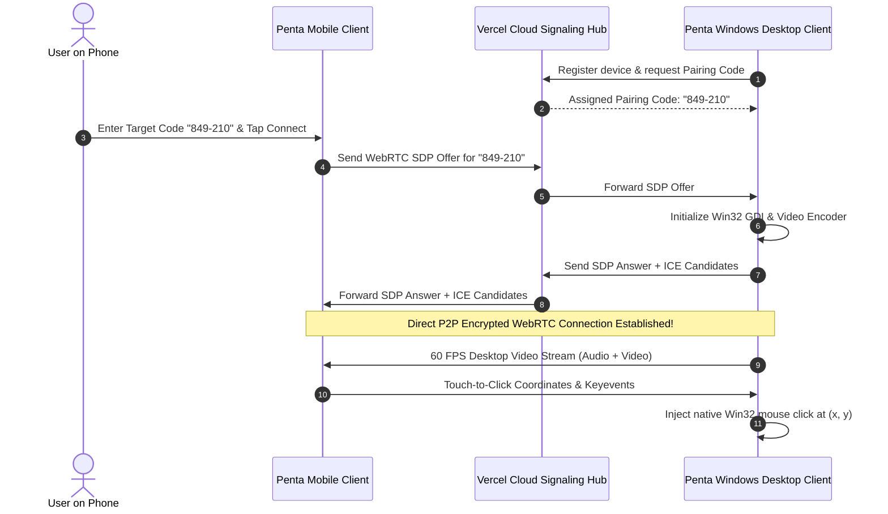
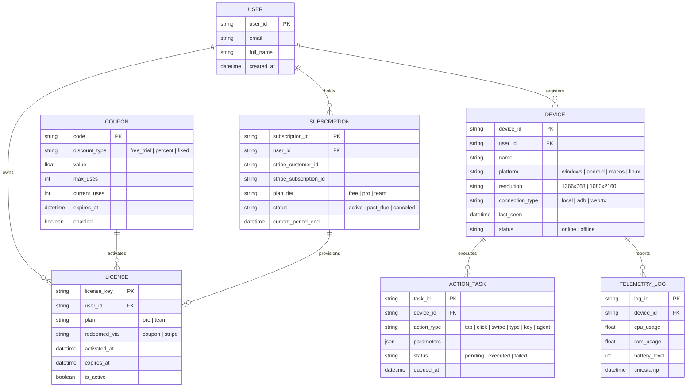

# ⚡ Penta-Assistant

> **Autonomous Google Antigravity Agentic AI + AnyDesk-Style Cross-Platform Remote Control**  
> *Operate, automate, and control Windows PC and Android devices from anywhere in the world.*

[](tests/)
[](docs/USER_MANUAL.md)
[](penta-app/)
[](vercel.json)
[](api/billing.py)

---

## 📖 Table of Contents

1. [Executive Overview](#1-executive-overview)
2. [System Architecture](#2-system-architecture)
   - [High-Level Topology](#high-level-topology)
   - [WebRTC Signaling & P2P Stream Sequence](#webrtc-signaling--p2p-stream-sequence)
   - [Entity-Relationship (ER) Diagram](#entity-relationship-er-diagram)
3. [Key Capabilities & Use Cases](#3-key-capabilities--use-cases)
4. [Resource Cost & Pricing Calculator](#4-resource-cost--pricing-calculator)
5. [Standalone Client Apps (Tauri v2 + Vite + React)](#5-standalone-client-apps-tauri-v2--vite--react)
6. [Quick Start & Installation Guide](#6-quick-start--installation-guide)
7. [Stripe Subscriptions & Admin Coupon Engine](#7-stripe-subscriptions--admin-coupon-engine)
8. [Automated Test Suite](#8-automated-test-suite)
9. [Project Directory Structure](#9-project-directory-structure)

---

## 1. Executive Overview

**Penta-Assistant** is a commercial-grade, subscription-ready software ecosystem that fuses two cutting-edge paradigms into a single unified platform:

1. **Google Antigravity Agentic AI**: Autonomous "Computer-Use" vision agents that perceive screen states, reason with multi-modal LLMs (Gemini 2.5 Flash, Claude 3.5 Sonnet, GPT-4o, Groq Llama 3, DeepSeek, local Ollama), and execute complex multi-step workflows.
2. **AnyDesk Cross-Platform Remote Control**: Ultra-low latency, hardware-accelerated remote screen viewing, tactile touch-to-click, directional gestures, hardware navigation keys, and bidirectional remote keyboard control between Windows PC and Android devices.

The system runs in two flexible operational modes:
* **Standalone Native Mode (Zero Local Server)**: Ultra-lightweight native client apps built with **Tauri v2 + Vite + React** (~12 MB installer, ~35 MB RAM).
* **Cloud & Web Console Mode**: Globally accessible serverless hub on **Vercel** with full Stripe subscription checkout, dynamic pricing calculator, and admin promo management.

---

## 2. System Architecture

### High-Level Topology

```mermaid
graph TB
    subgraph CloudRelay["Vercel Cloud Serverless Hub (https://penta-assistant.vercel.app)"]
        LP["Landing Page & Download Center<br/>(Windows .exe & Android .apk)"]
        CostCalc["Dynamic Resource Cost Calculator<br/>(AI Tokens + TURN Bandwidth + Cloud)"]
        StripeEng["Stripe Billing & Subscriptions<br/>(/api/stripe/create-checkout, /webhook)"]
        CouponEng["Coupon & Promo Code Engine<br/>(/api/coupons/redeem)"]
        AdminDash["Admin Management Console<br/>(/admin - Coupons, Subscribers, MRR)"]
        SignalingRelay["WebRTC Signaling Hub & Registry<br/>(6-Digit Device Pairing Codes)"]
    end

    subgraph HostPC["Windows PC Host Node"]
        WinGDI["Native Win32 GDI / DXGI<br/>(~15ms Screen Capture)"]
        WinInput["Hardware Input Injector<br/>(Mouse, Double/Right Click, Win+D, Hotkeys)"]
        WinAgent["Google Antigravity PC Agent<br/>(Perception, Reasoning, Tool Calling)"]
        WinTauri["Penta Desktop App (Tauri v2)"]
    end

    subgraph AndroidNode["Android Phone Node (Redmi Note 6 Pro)"]
        MobCap["Screencap / MediaProjection Engine"]
        MobTouch["Touch & Gesture Injector<br/>(Tap, Directional Swipes, Text)"]
        MobKeys["Hardware Navigation Bar<br/>(Back, Home, Recents, Power, Vol)"]
        MobAgent["Google Antigravity Mobile Agent"]
        MobTauri["Penta Mobile App (Tauri APK)"]
    end

    LP --> WinTauri
    LP --> MobTauri
    StripeEng --> AdminDash
    CouponEng --> AdminDash
    SignalingRelay <-->|SDP / ICE Signaling| WinTauri
    SignalingRelay <-->|SDP / ICE Signaling| MobTauri
    WinTauri <==>|Encrypted P2P WebRTC Stream (30-60 FPS)| MobTauri
```

---

### WebRTC Signaling & P2P Stream Sequence



---

### Entity-Relationship (ER) Diagram



---

## 3. Key Capabilities & Use Cases

### 📱 Use Case 1: Control Windows PC from Android Phone
* **Live Touch-to-Click**: Tap anywhere on the PC desktop stream on your phone to trigger a live, auto-scaled mouse click on Windows.
* **One-Tap Quick Actions**: Lock Workstation (`Win+L`), Show Desktop (`Win+D`), Volume Up/Down, Mute, Media Play/Pause.
* **App Launchers**: Instant launch buttons for Google Chrome, Notepad, Calculator, File Explorer, PowerShell Terminal, or open any web link.
* **Remote Keyboard**: Type any text directly into the focused Windows application.

### 🖥️ Use Case 2: Control Android Phone from PC or Browser
* **Tactile Screen Interaction**: Tap, drag, and interact with your physical Android phone directly from your desktop.
* **Hardware Navigation Bar**: Dedicated physical button triggers for **◀️ Back** (keycode 4), **⏺️ Home** (keycode 3), **🔲 Recent Apps** (keycode 187), and **⚡ Power/Wake** (keycode 26).
* **Directional Gestures**: One-click gestures for **⬆️ Scroll Down (Swipe Up)**, **⬇️ Scroll Up (Swipe Down)**, **⬅️ Swipe Left**, and **➡️ Swipe Right**.
* **Quick Android App Launchers**: Settings, Chrome, Camera, YouTube, Calculator, Phone Dialer, WhatsApp.

### 🤖 Use Case 3: Autonomous Google Antigravity AI Agents
* **Local & Remote Computer-Use**: Input natural language directives (e.g. *"Open Notepad and write today's task plan"* or *"Open Settings and check Wi-Fi status"*).
* **Multi-Model Unified Gateway**: Seamlessly switch between Gemini 2.5 Flash, Claude 3.5 Sonnet, GPT-4o, Groq Llama 3, DeepSeek, and local Ollama with automated fallback.
* **5-Agent Autonomous Organization**: Coordinates missions across CEO Orchestrator, Mobile Node, Desktop Node, Browser Intelligence, and Alert Notifier.

---

## 4. Resource Cost & Pricing Calculator

Penta-Assistant provides a transparent unit economics calculator based on actual infrastructure consumption:

| Resource Vector | Consumption Basis | Monthly Cost / Active User |
| :--- | :--- | :--- |
| **Google Antigravity AI Engine** | ~250 vision/action calls/mo (~5M tokens on Gemini 2.5 Flash) | **\$1.75 / mo** |
| **WebRTC P2P & TURN Relay** | ~15 hrs remote streaming/mo (20% relayed through TURN bandwidth) | **\$0.90 / mo** |
| **Cloud Signaling & Edge State** | Vercel Serverless Function invocations + Edge Registry | **\$0.45 / mo** |
| **Infrastructure & Gateway Margin** | Stripe processing fee (2.9% + 30¢), reserve | **\$0.90 / mo** |
| **TOTAL BASE OPERATING COST** | | **~\$4.00 / user / mo** |

### Pricing Tiers:
* **Free Starter (\$0/mo)**: 1 device, LAN remote viewport, BYOK AI keys, 30 min/day cloud relay.
* **Penta Pro (\$12/mo)**: Unlimited P2P WebRTC remote control, 2,000 autonomous AI steps/mo, 5 paired devices, cloud clipboard sync.
* **Penta Team (\$29/seat/mo)**: 5-agent organizational missions, dedicated TURN relays, admin console, priority routing.

> **Savings:** Compared to purchasing AnyDesk Pro (\$14.90/mo) + ChatGPT Plus (\$20/mo) = **\$34.90/mo**, Penta-Assistant saves customers **over \$22.90 every month**!

---

## 5. Standalone Client Apps (Tauri v2 + Vite + React)

The client application lives in `penta-app/` and runs with **zero local server**:

* **Frontend**: Pure Vite + React SPA with modern dark aesthetic.
* **Backend**: Compiled Rust core with direct Win32 API calls (`windows-rs`) for screen capture and hardware input injection.
* **Footprint**: ~12 MB installer, ~35 MB RAM, 0% CPU at idle.

### Building the Client App:
```powershell
cd C:\AI-Android-Agent\penta-app

# 1. Install dependencies
npm install

# 2. Build production web bundle
npm run build

# 3. Compile native Windows executable (.exe)
npm run tauri build
```

---

## 6. Quick Start & Installation Guide

### Prerequisites
* **Windows 10 / 11 x64**
* **Python 3.10+** (Python 3.13 tested)
* **Node.js v20+** & **Rust 1.80+** (for Tauri builds)
* **Android Debug Bridge (ADB)** (included or auto-detected)

### Step 1: Clone and Configure Environment
```powershell
git clone https://github.com/your-username/penta-assistant.git C:\AI-Android-Agent
cd C:\AI-Android-Agent

# Copy sample environment configuration
cp .env.example .env
```
Edit `.env` to configure your API keys:
```ini
GEMINI_API_KEY=your_gemini_api_key_here
MODEL_PROVIDER=gemini
MODEL_NAME=gemini-2.5-flash
ADMIN_SECRET_KEY=penta_admin_secret_2026
STRIPE_SECRET_KEY=sk_test_...
```

### Step 2: Launch the Local Web Hub & Dashboard
```powershell
# Double-click run_ui.bat or run:
python ui.py
```
Open **`http://localhost:5050`** in your browser (or from your phone via Wi-Fi/Tailscale).

### Step 3: Connect Your Android Phone
1. Enable **Developer Options** & **USB Debugging** on your phone.
2. Plug in via USB cable and allow connection.
3. Switch to wireless mode in one click:
   - Tap **"📶 Switch to Wi-Fi"** in the top bar. You can now unplug the USB cable!

### Step 4: Deploy to Vercel (Global Cloud Hub)
```powershell
npm install -g vercel
vercel
```

---

## 7. Stripe Subscriptions & Admin Coupon Engine

### Accessing the Admin Console
Navigate to **`http://localhost:5050/admin`** to access the protected management interface:
* View Monthly Recurring Revenue (MRR) and active subscribers.
* Create custom promotional coupon codes with instant activation rules:
  * **Free Trial Days** (e.g. 365 days 100% free)
  * **Percentage Discount** (e.g. 50% off)
  * **Fixed Dollar Off**
* Toggle or revoke coupon codes in real time.

### Default Built-in Promo Codes
* **`PENTAFREE`**: Unlocks 1 full year of 100% Free Pro access.
* **`LAUNCH50`**: Unlocks 50% discount on Pro plans.

---

## 8. Automated Test Suite

The project includes an extensive automated test suite covering safety, models, multi-agent communication, PC hardware control, central device hub, billing, and coupons:

```powershell
# Run the complete test suite
python -m pytest tests/ -v
```

```text
============================= 39 passed in 6.68s =============================
tests/test_action_validation.py::test_valid_tap PASSED                   [  2%]
tests/test_action_validation.py::test_invalid_tap_coords PASSED          [  5%]
tests/test_action_validation.py::test_valid_key_event PASSED             [  7%]
tests/test_action_validation.py::test_invalid_key_event PASSED           [ 10%]
tests/test_adb_security.py::test_reject_shell_injection PASSED           [ 12%]
tests/test_adb_security.py::test_reject_malicious_package PASSED         [ 15%]
tests/test_adb_security.py::test_safe_sanitization PASSED                [ 17%]
tests/test_billing_and_coupons.py::test_create_and_redeem_coupon PASSED  [ 20%]
tests/test_billing_and_coupons.py::test_invalid_and_expired_coupon PASSED [ 23%]
tests/test_billing_and_coupons.py::test_coupon_usage_limit PASSED        [ 25%]
tests/test_billing_and_coupons.py::test_toggle_coupon PASSED             [ 28%]
tests/test_billing_and_coupons.py::test_resource_cost_calculator PASSED  [ 30%]
tests/test_billing_and_coupons.py::test_stripe_checkout_generation PASSED [ 33%]
tests/test_billing_and_coupons.py::test_admin_metrics PASSED             [ 35%]
tests/test_multi_models.py::test_all_providers_registered PASSED         [ 38%]
tests/test_multi_models.py::test_openai_compatible_initialization PASSED [ 41%]
tests/test_multi_models.py::test_groq_initialization PASSED              [ 43%]
tests/test_multi_models.py::test_anthropic_initialization PASSED         [ 46%]
tests/test_multi_models.py::test_json_extraction_from_markdown PASSED    [ 48%]
tests/test_multi_models.py::test_fallback_mechanism PASSED               [ 51%]
tests/test_open_calculator.py::test_agent_open_calculator PASSED         [ 53%]
tests/test_open_settings.py::test_agent_open_settings PASSED             [ 56%]
tests/test_organization.py::test_bus_direct_routing PASSED               [ 58%]
tests/test_organization.py::test_desktop_write_and_read PASSED           [ 61%]
tests/test_organization.py::test_notifier_alert PASSED                   [ 64%]
tests/test_organization.py::test_end_to_end_cognitive_mission PASSED     [ 66%]
tests/test_pc_control.py::test_screen_resolution PASSED                  [ 69%]
tests/test_pc_control.py::test_screen_capture_jpeg PASSED                [ 71%]
tests/test_pc_control.py::test_coordinate_scaling PASSED                 [ 74%]
tests/test_pc_control.py::test_hotkey_validation PASSED                  [ 76%]
tests/test_pc_control.py::test_pc_agent_execution PASSED                 [ 79%]
tests/test_penta_hub.py::test_device_registration PASSED                 [ 82%]
tests/test_penta_hub.py::test_device_active_list PASSED                  [ 84%]
tests/test_penta_hub.py::test_action_queueing_and_polling PASSED         [ 87%]
tests/test_penta_hub.py::test_coordinate_normalization PASSED            [ 89%]
tests/test_penta_hub.py::test_frame_buffer_cache PASSED                  [ 92%]
tests/test_penta_hub.py::test_android_package_map PASSED                 [ 94%]
tests/test_ui_hierarchy.py::test_hierarchy_parsing PASSED                [ 97%]
tests/test_ui_hierarchy.py::test_find_by_text PASSED                     [100%]
```

---

## 9. Project Directory Structure

```text
C:\AI-Android-Agent├── adb/                    # ADB physical & wireless Android driver
│   └── client.py           # Touch injection, keyevents, screencap, monkey launch
├── agent/                  # Autonomous Computer-Use agents
│   ├── orchestrator.py     # Perception -> Reasoning -> Action loop
│   └── pc_agent.py         # Autonomous Windows desktop agent
├── api/                    # Commercial SaaS & Vercel serverless functions
│   ├── index.py            # Global Vercel serverless request handler
│   ├── billing.py          # Stripe Checkout & dynamic cost calculator
│   ├── coupons.py          # Coupon creation & license verification
│   └── admin_dashboard.py  # Admin Management Console & metrics
├── hub/                    # Central Device Hub & Mesh routing
│   └── device_hub.py       # Device registry, frame buffer, coordinate scaling
├── models/                 # Unified Multi-Model Gateway
│   ├── router.py           # Provider registry & fallback mechanism
│   ├── gemini.py           # Google Gemini 2.5 Flash provider
│   ├── anthropic_provider.py # Claude 3.5 Sonnet provider
│   ├── openai_compatible.py  # GPT-4o, Groq, DeepSeek, OpenRouter, Ollama
├── organization/           # 5-Agent Autonomous Organization
│   ├── event_bus.py        # Asynchronous decoupled event routing
│   ├── command_center.py   # Multi-agent organizational mission runner
│   └── remote_bridge.py    # Outbound telemetry for 4G/5G mobile nodes
├── pc_control/             # Windows PC hardware controller
│   └── desktop_controller.py # Win32 GDI screen grabber & input injector
├── penta-app/              # Standalone Native Client Apps (Zero Local Server)
│   ├── src/                # Vite + React interface (AnyDesk Viewport + Co-Pilot)
│   ├── src-tauri/          # Tauri v2 Rust native core
│   ├── package.json        # Frontend dependencies
│   └── vite.config.js      # Vite build configuration
├── tests/                  # 39 unit and integration tests
├── tools/                  # Diagnostics & scrcpy launchers
├── docs/                   # Full user manuals and technical specifications
├── ui.py                   # Penta-Assistant local web dashboard & server
├── vercel.json             # Vercel serverless deployment configuration
└── README.md               # Project documentation
```

---

## 📄 License & Intellectual Property

Built with **Google Antigravity Agentic Coding Architecture**.  
Designed for distributed computer-use automation across Windows, Android, and Cloud devices.
