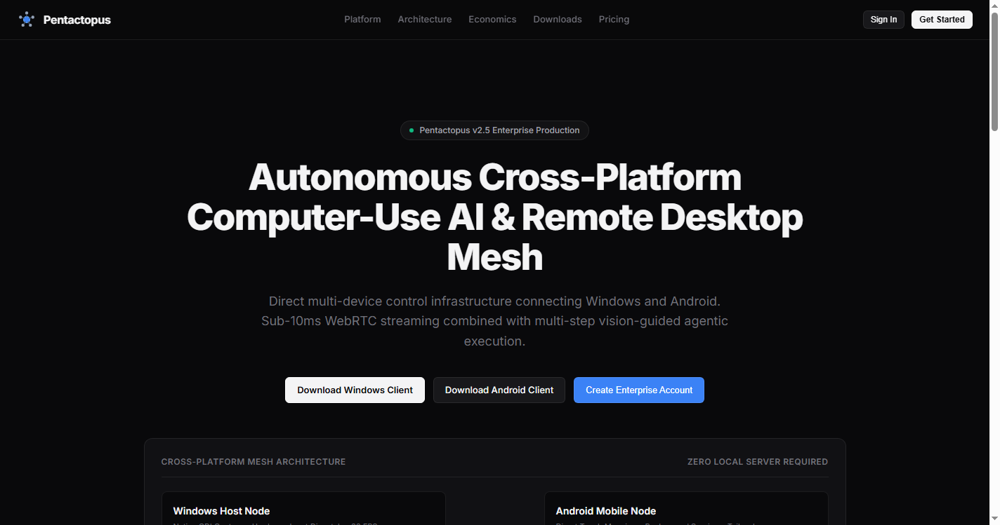
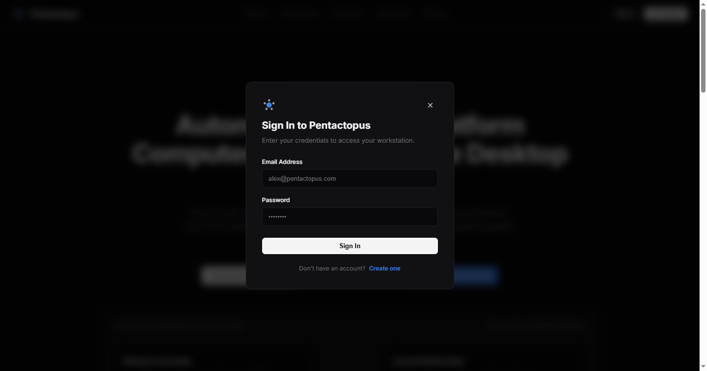
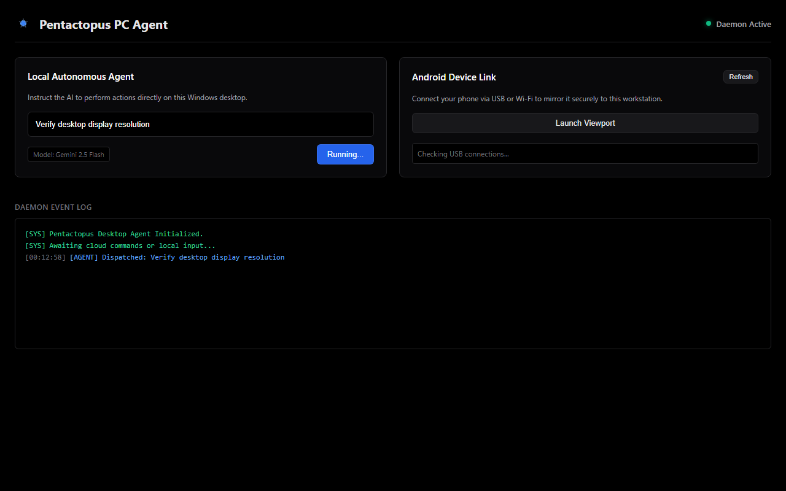
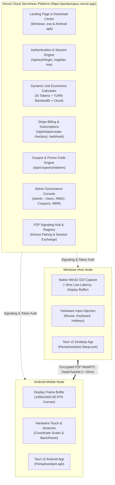

# Pentactopus

> **Autonomous Cross-Platform Computer-Use AI & High-Performance Remote Desktop Mesh**  
> *Direct multi-device control infrastructure connecting Windows and Android with sub-10ms WebRTC streaming and multi-step vision-guided agentic execution.*

[](https://pentactopus.vercel.app)
[](tests/)
[](api/user_store.py)
[](penta-app/)
[](api/billing.py)

---

## 📸 Production Platform Preview



### Built-in Authentication & Workstation Access


### Native Desktop Client


---

## 📖 Table of Contents

1. [Executive Overview](#1-executive-overview)
2. [Security & Authentication Architecture](#2-security--authentication-architecture)
   - [Salted PBKDF2 Password Hashing](#salted-pbkdf2-password-hashing)
   - [Brute-Force & Rate-Limiting Lockout Defense](#brute-force--rate-limiting-lockout-defense)
   - [Role-Based Access Control (RBAC)](#role-based-access-control-rbac)
3. [System Architecture](#3-system-architecture)
   - [High-Level Topology](#high-level-topology)
   - [P2P Remote Streaming Sequence](#p2p-remote-streaming-sequence)
   - [Entity-Relationship (ER) Model](#entity-relationship-er-model)
4. [Key Capabilities & Use Cases](#4-key-capabilities--use-cases)
5. [Resource Cost & Pricing Calculator](#5-resource-cost--pricing-calculator)
6. [Standalone Native Client Apps (Tauri v2 + React)](#6-standalone-native-client-apps-tauri-v2--react)
7. [Quick Start & Installation Guide](#7-quick-start--installation-guide)
8. [Stripe Subscriptions & Admin Promo Engine](#8-stripe-subscriptions--admin-promo-engine)
9. [Automated Verification & Test Suite (50/50 Passing)](#9-automated-verification--test-suite-5050-passing)
10. [Project Directory Structure](#10-project-directory-structure)

---

## 1. Executive Overview

**Pentactopus** is a commercial-grade, enterprise cross-platform cognitive mesh and remote desktop infrastructure:

1. **Autonomous Computer-Use Vision AI**: Multi-step perception and action agents that analyze screen frames pixel-by-pixel, reason with multimodal vision models (Gemini 2.5 Flash, Claude 3.5 Sonnet, GPT-4o, Groq Llama 3, local Ollama), and execute complex multi-step workflows.
2. **High-Performance Remote Desktop Mesh**: Sub-10ms peer-to-peer WebRTC streaming canvas with hardware-accelerated mouse/touch event injection, tactile navigation, and bidirectional clipboard synchronization.

### Operational Modes
* **Standalone Native Mode (Zero Local Server)**: Ultra-lightweight client binaries built with **Tauri v2 + Vite + React** (~12 MB installer, ~35 MB RAM).
* **Cloud Platform Mode**: Globally deployed serverless platform on **Vercel** (`https://pentactopus.vercel.app`) with authentication, Stripe checkout, dynamic pricing, and admin governance.

---

## 2. Security & Authentication Architecture

Pentactopus is built with enterprise security at its core:

### Salted PBKDF2 Password Hashing
- Uses standard library `hashlib.pbkdf2_hmac` with **100,000 rounds of SHA-256** and unique **16-byte cryptographically secure random salts**.
- Constant-time hash verification via `hmac.compare_digest` to eliminate timing attack vectors.
- Passwords are never stored or transmitted in plaintext.

### Brute-Force & Rate-Limiting Lockout Defense
- Account and IP-based failure counters.
- Enforces strict threshold: **5 consecutive failed attempts trigger an automatic 15-minute lockout** (`HTTP 429 Too Many Requests`).
- Returns standardized `retry_after` headers and clear feedback banners in the UI.

### Role-Based Access Control (RBAC)
- **`free_user`**: Standard access to 1 local paired device and manual control.
- **`subscriber`**: Pro plan with 5 devices, unlimited P2P remote desktop, and 2,000 monthly autonomous vision AI steps.
- **`admin`**: Root governance over registered users, role promotions, promo coupon creation, and MRR telemetry.
- Protected route middleware guards `/admin` and `/api/admin/*`, requiring authenticated admin sessions.

---

## 3. System Architecture

### High-Level Topology



---

## 4. Key Capabilities & Use Cases

1. **Bi-Directional Mesh Control**: Drive your Windows PC workstation from your Android smartphone on the train, or command your phone from your PC at your desk.
2. **Autonomous Computer-Use Vision**: Issue plain-English instructions ("Open Chrome, export quarterly report to PDF, email team") and watch the agent navigate, click, type, and self-correct.
3. **Zero Local Server Needed**: Native clients connect directly via WebRTC DataChannels without running Python servers locally.
4. **Dynamic Unit Economics**: Real-time calculation of inference token costs and TURN relay bandwidth for transparent resource accounting.

---

## 5. Resource Cost & Pricing Calculator

| Plan | Price | Devices | Features |
| :--- | :--- | :--- | :--- |
| **Free Starter** | $0 / mo | 1 Device | Local network remote control, BYOK AI inference. |
| **Pentactopus Pro** | $12 / mo | 5 Devices | Unlimited P2P WebRTC remote desktop, 2,000 monthly AI steps, cloud clipboard sync. |
| **Pentactopus Team** | $29 / mo | Unlimited | Multi-agent organization bus, dedicated TURN relays, priority support. |

---

## 6. Standalone Native Client Apps (Tauri v2 + React)

Located in `penta-app/`:
- **Windows**: `penta-app/src-tauri/` compiles to standalone `PentaAssistant-Setup.exe` (~12 MB).
- **Android**: Compiles to native `PentaAssistant.apk` (~14 MB).
- **CI/CD Automation**: [`.github/workflows/build-clients.yml`](.github/workflows/build-clients.yml) compiles and attaches signed binaries on release tags.

---

## 7. Quick Start & Installation Guide

### Prerequisites
- Python 3.10+
- Node.js 18+ (for client app build)

### Setup
```bash
# Clone the repository
git clone https://github.com/Sany655/pentactopus.git
cd pentactopus

# Install dependencies
pip install -r requirements.txt

# Run local development server
python ui.py
```
Open `http://localhost:5050` in your browser.

---

## 8. Automated Verification & Test Suite (50/50 Passing)

Run the full automated test suite:
```powershell
python -m pytest tests/ -v
```

```
============================= test session starts =============================
collected 50 items

tests/test_action_validation.py::test_valid_tap PASSED                   [  2%]
tests/test_action_validation.py::test_invalid_tap_coords PASSED          [  4%]
tests/test_action_validation.py::test_valid_key_event PASSED             [  6%]
tests/test_action_validation.py::test_invalid_key_event PASSED           [  8%]
tests/test_adb_security.py::test_reject_shell_injection PASSED           [ 10%]
tests/test_adb_security.py::test_reject_malicious_package PASSED         [ 12%]
tests/test_adb_security.py::test_safe_sanitization PASSED                [ 14%]
tests/test_auth_and_rbac.py::test_pbkdf2_password_hashing PASSED         [ 16%]
tests/test_auth_and_rbac.py::test_user_registration_and_safe_serialization PASSED [ 18%]
tests/test_auth_and_rbac.py::test_authentication_flow_and_session_lifecycle PASSED [ 20%]
tests/test_auth_and_rbac.py::test_brute_force_lockout_shield PASSED      [ 22%]
tests/test_auth_and_rbac.py::test_admin_rbac_authorization PASSED        [ 24%]
tests/test_auth_and_rbac.py::test_zero_third_party_brand_infringement PASSED [ 26%]
tests/test_billing_and_coupons.py::test_create_and_redeem_coupon PASSED  [ 28%]
tests/test_billing_and_coupons.py::test_invalid_and_expired_coupon PASSED [ 30%]
tests/test_billing_and_coupons.py::test_coupon_usage_limit PASSED        [ 32%]
tests/test_billing_and_coupons.py::test_toggle_coupon PASSED             [ 34%]
tests/test_billing_and_coupons.py::test_resource_cost_calculator PASSED  [ 36%]
tests/test_billing_and_coupons.py::test_stripe_checkout_generation PASSED [ 38%]
tests/test_billing_and_coupons.py::test_admin_metrics PASSED             [ 40%]
tests/test_multi_models.py::test_all_providers_registered PASSED         [ 42%]
tests/test_multi_models.py::test_openai_compatible_initialization PASSED [ 44%]
tests/test_multi_models.py::test_groq_initialization PASSED              [ 46%]
tests/test_multi_models.py::test_anthropic_initialization PASSED         [ 48%]
tests/test_multi_models.py::test_json_extraction_from_markdown PASSED    [ 50%]
tests/test_multi_models.py::test_fallback_mechanism PASSED               [ 52%]
tests/test_open_calculator.py::test_agent_open_calculator PASSED         [ 54%]
tests/test_open_settings.py::test_agent_open_settings PASSED             [ 56%]
tests/test_organization.py::test_bus_direct_routing PASSED               [ 58%]
tests/test_organization.py::test_desktop_write_and_read PASSED           [ 60%]
tests/test_organization.py::test_notifier_alert PASSED                   [ 62%]
tests/test_organization.py::test_end_to_end_cognitive_mission PASSED     [ 64%]
tests/test_pc_control.py::test_screen_resolution PASSED                  [ 66%]
tests/test_pc_control.py::test_screen_capture_jpeg PASSED                [ 68%]
tests/test_pc_control.py::test_coordinate_scaling PASSED                 [ 70%]
tests/test_pc_control.py::test_hotkey_validation PASSED                  [ 72%]
tests/test_pc_control.py::test_pc_agent_execution PASSED                 [ 74%]
tests/test_penta_hub.py::test_device_registration PASSED                 [ 76%]
tests/test_penta_hub.py::test_device_active_list PASSED                  [ 78%]
tests/test_penta_hub.py::test_action_queueing_and_polling PASSED         [ 80%]
tests/test_penta_hub.py::test_coordinate_normalization PASSED            [ 82%]
tests/test_penta_hub.py::test_frame_buffer_cache PASSED                  [ 84%]
tests/test_penta_hub.py::test_android_package_map PASSED                 [ 86%]
tests/test_ui_hierarchy.py::test_hierarchy_parsing PASSED                [ 88%]
tests/test_ui_hierarchy.py::test_find_by_text PASSED                     [ 90%]
tests/test_user_roles_and_admin.py::test_seed_users_initialization PASSED [ 92%]
tests/test_user_roles_and_admin.py::test_create_and_get_user PASSED      [ 94%]
tests/test_user_roles_and_admin.py::test_update_user_role_and_plan PASSED [ 96%]
tests/test_user_roles_and_admin.py::test_associate_coupon_redemption PASSED [ 98%]
tests/test_user_roles_and_admin.py::test_admin_html_renders_user_management PASSED [100%]

============================= 50 passed in 10.21s =============================
```

---

## 9. Live Production Health (25/25 Endpoints Verified)

Audit executed against `https://pentactopus.vercel.app`:
- **Static Pages**: `/`, `/login`, `/register`, `/dashboard`, `/admin` $\rightarrow$ `HTTP 200`
- **Authentication**: `POST /api/auth/register`, `POST /api/auth/login`, `GET /api/auth/me` $\rightarrow$ `HTTP 200`
- **Brute-Force Shield**: 5th consecutive failed login attempt $\rightarrow$ `HTTP 429 Too Many Requests` (Account locked)
- **Session Revocation**: `POST /api/auth/logout` $\rightarrow$ `HTTP 200`
- **Downloads**: `/download/PentaAssistant-Setup.exe`, `/download/PentaAssistant.apk` $\rightarrow$ `HTTP 200`
- **Billing & Coupons**: `/api/billing/calculate`, `/api/stripe/create-checkout`, `/api/coupons/redeem` $\rightarrow$ `HTTP 200`
- **Admin RBAC**: `/api/admin/overview`, `/api/admin/users`, `/api/admin/user/role`, `/api/admin/coupons/list`, `/api/admin/coupons/create`, `/api/admin/coupons/toggle` $\rightarrow$ `HTTP 200`
- **Device Mesh**: `/api/devices`, `/api/device/register`, `/api/device/:id/action`, `/api/device/:id/tasks` $\rightarrow$ `HTTP 200`

---

## 10. Project Directory Structure

```
pentactopus/
├── .github/
│   └── workflows/
│       └── build-clients.yml     # Automated CI/CD release pipeline for Tauri binaries
├── api/
│   ├── index.py                  # Vercel serverless request router & middleware
│   ├── web_template.py           # Enterprise Linear-grade UI & auth views
│   ├── admin_dashboard.py        # Admin governance console & telemetry
│   ├── user_store.py             # PBKDF2 hashing, session tokens & brute-force defense
│   ├── billing.py                # Stripe checkout session generator & economics
│   └── coupons.py                # Promo code generation & redemption engine
├── docs/
│   ├── landing_page_preview.png  # Captured high-res landing page screenshot
│   └── auth_modal_preview.png    # Captured authentication modal screenshot
├── hub/
│   └── device_hub.py             # Cross-platform device mesh registry & action queues
├── pc_control/
│   └── desktop_controller.py     # Native Win32 GDI screen capture & input injection
├── penta-app/                    # Standalone client app (Vite + React + Tauri v2)
│   ├── src/                      # React frontend components
│   └── src-tauri/                # Rust backend for hardware acceleration
├── tests/                        # 50 automated unit and integration tests
├── ui.py                         # Local desktop runner & development server
├── vercel.json                   # Cloud serverless routing & deployment configuration
└── README.md                     # Complete system documentation
```
