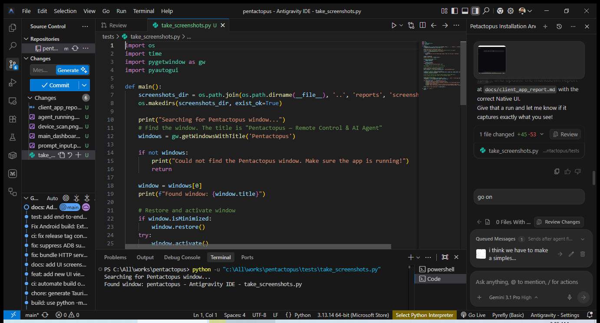

# Client App Features & Screenshots

This document contains automated screenshots of the Pentactopus Native Client (Tauri/React).

## Main Interface

> Note: The automated script captures the native desktop window. Further UI interactions require DOM inspection or coordinate mapping.
